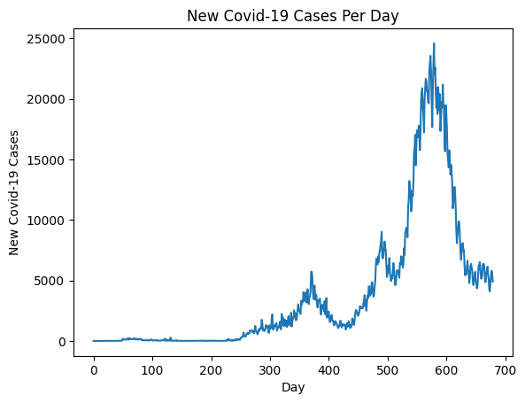
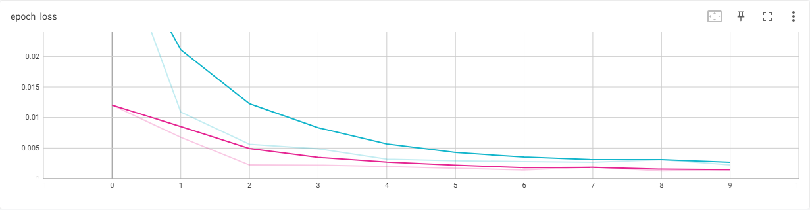
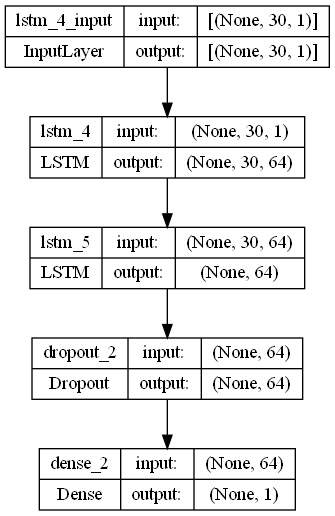
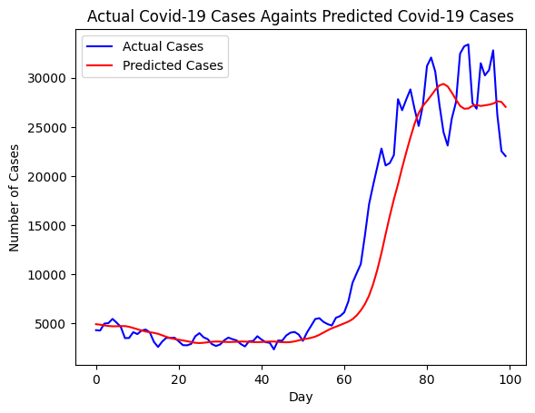
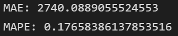

# Analysing & Predicting New Covid-19 Cases in Malaysia with an RNN Model

The project is made to analyse daily updates of new Covid-19 cases in Malaysia through the use of the dataset released by [MoH-Malaysia](https://github.com/MoH-Malaysia/covid19-public). The data is then used to train an RNN model which are then able to make prediction on the future amount of new Covid-19 daily cases. 

The RNN model is build using LSTM layers which allows it to remember past input and using it together with the present input to make adjustments to the weight. This is made possible through the use of a memories highway which also allows it to avoid a vanishing gradient problem. The model is made up of 2 layers of LSTM with 64 nodes each. The model managed to score an average of 0.17% in mean average percentage error (MAPE) and is able to adequately predict the pattern and trend for the test data given. The detailed result and prediction made by the model is shown in the [Visualization](#visualization) section.

## Steps Taken

### Step 1 - Data loading  

> The data is load into the model from its csv dataset using pandas.read_csv().
  
### Step 2 - Data inspection  

> During data inspection, the detail of the dataset is examine and understood. The 'cases_new' column in the dataset is found to be of the 'object' dtype when it is supposed to be a column of integers for the amount of new cases. The dataset is checked for any NaN values or duplicates. The dataset does not have any duplicates but do have some NaN values which needed to be filled up.

  

  

Daily new Covid-19 cases in Malaysia.

### Step 3 - Data cleaning  

> The 'cases_new' column is converted to integers using 'to_numeric' function from pandas. The NaN values are filled up using polynormial interpolation and further inspection confirmed that the data is now free from any NaN values.
  
### Step 4 - Features selection  

> The column that will be use in the model training is chosen and defined into a separate variable.
 
### Step 5 - Data pre-preprocessing  

> The data is normalized into a range of 0 to 1 with a MinMaxScaler and it is cut into a time frame of 30 days of features for a day of target. The data is then split into a set of training data and a set of validation data.

### Step 6 - Model development  

> A model focused on the 2 layers of LSTM with 64 nodes each is build as the hidden layer. The data processed in the previous step is then fit into the model and the model is trained for 10 epochs. The training process of the model is monitored through TensoBoard.

  

 

Loss change during the model training.
 

### Step 7 - Model evaluation  

> The evaluation of the model is made with the MAPE metrics in which the model scored between 0.16% until 0.20% of errors value between test run. The detailed results of the model is displayed in the [Visualization](#visualization) section below.

### Step 8 - Model saving

> The scaler and model is save into their own files to be loaded for deployment.
  
## Visualization

 

  

  

Architecture for model used in the project.

 

  

  

Prediction made by the model againts the ground truth.

 

  

  

Mean absolute error (MAE) and mean absolute percentage error (MAPE) for the model prediction.

## Acknowledgement

The dataset is obtained from [MoH-Malaysia](https://github.com/MoH-Malaysia/covid19-public) covid19-public repository.

